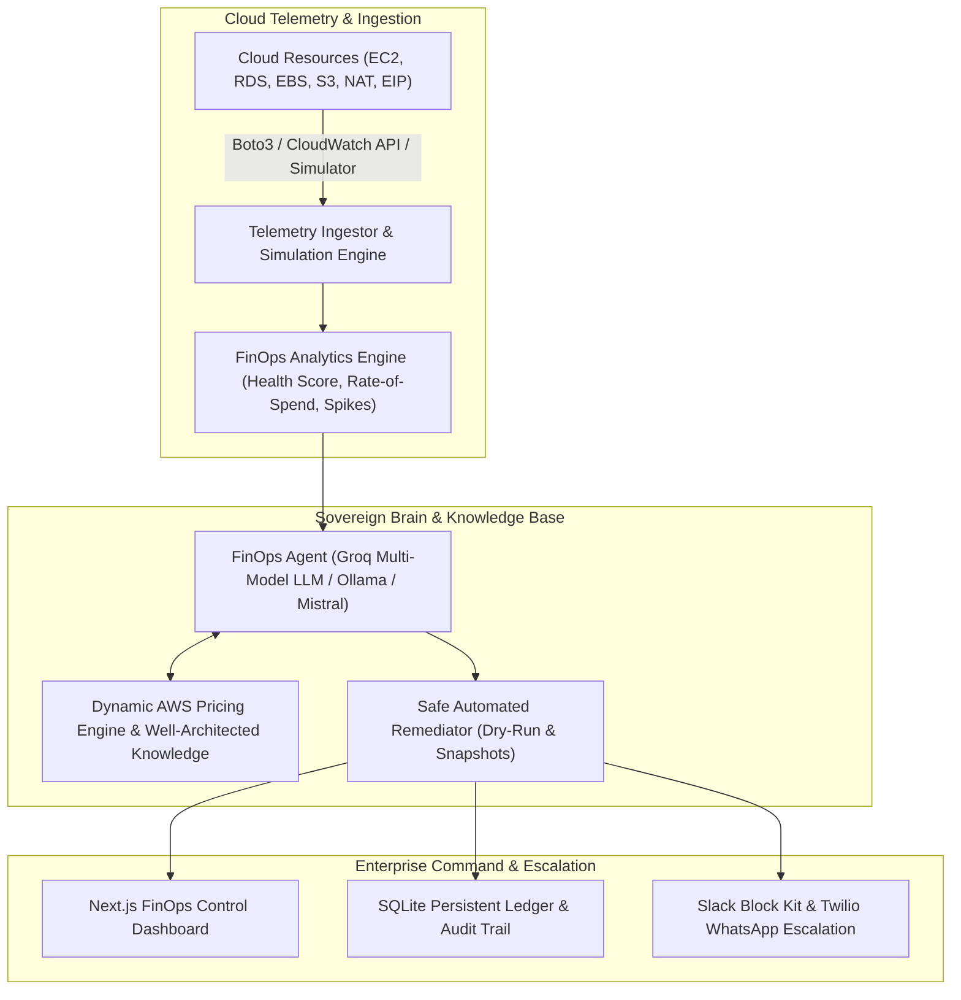

# ☁️ CloudPulse: Autonomous FinOps & Multi-Cloud Cost Optimization Platform
### *Autonomous Cloud Telemetry, Cost Anomaly Diagnostics & Automated FinOps Remediation*

[](https://www.python.org/)
[](https://fastapi.tiangolo.com/)
[](https://nextjs.org/)
[](https://www.docker.com/)
[](backend/tests/)
[](https://www.finops.org/)

---

## 📖 Overview

**CloudPulse** is an enterprise-grade, autonomous cloud cost optimization and infrastructure security platform. Built on the architectural principles of high-reliability industrial monitoring (adapted directly from the **Sovereign Industrial Backbone** in `predictive_maintainance_system`), CloudPulse transforms raw multi-cloud telemetry (AWS CloudWatch, Azure Monitor, GCP Cloud Monitoring) into actionable FinOps savings and automated remediation.



---

## 🌟 Key Enterprise Capabilities

- **⚡ FinOps 4-Pillar Health Score:** Instant 0–100 score across Compute Efficiency, Storage Optimization, Network Cleanliness, and Security Posture.
- **📈 Rate-of-Spend Acceleration & Anomaly Detection:** Identifies spend surges (>25% spike over 7-day moving average) with AI-powered root-cause forensics.
- **🤖 Autonomous FinOps AI Copilot:** Powered by **Groq Cloud Multi-Model Engine** (`groq/compound-mini`, `groq/compound`, `qwen/qwen3.8-27b`, `openai/gpt-oss-120b`) with resilient fallback to local **Ollama** and **Mistral AI**, featuring interactive slash commands (`/audit`, `/optimize`, `/forecast`, `/health`, `/pricing`, `/remediate`).
- **🛡️ Safe Automated Remediation:** 1-click or automated policy fixes with dry-run protection, automatic EBS safety snapshotting before deletion, gp2 to gp3 migrations, and 0.0.0.0/0 port revocations.
- **🏗️ Automated Terraform / OpenTofu PR Generator:** Produces clean HCL diffs, migration safety plans, and pull request bodies to remediate waste automatically.
- **📚 TimescaleDB Telemetry Ledger:** Time-series hypertables storing infrastructure metrics, FOCUS 1.0 billing records, and audit history.
- **🎮 Simulation & Demo Engine:** Full standalone offline testing and interactive demo mode without requiring live AWS credentials.

---

## 💬 Slash Commands

Interact with the FinOps Agent via the `/api/v1/agent/chat` endpoint or web terminal:

| Slash Command | Description |
| :--- | :--- |
| `/audit` | Runs a comprehensive FinOps and security audit, outputting overall health, potential savings, and AI executive briefing. |
| `/optimize` | Lists all prioritized savings recommendations categorized by Quick Wins and architectural changes with AI rationale. |
| `/forecast` | Calculates daily burn rate, projected month-end bill, budget status, and runway days. |
| `/health` | Breaks down the 4-pillar FinOps health score (Compute, Storage, Network, Security). |
| `/pricing [type] [region]` | Looks up real-time hourly and monthly On-Demand pricing for any instance type and AWS region. |
| `/remediate [id]` | Evaluates and tests safe automated remediations in dry-run mode. |
| `/help` | Lists all available FinOps agent commands. |

---

## 📂 Repository File Structure

```
Cloud_Cost_Optimization/
├── backend/
│   ├── main.py                        # FastAPI Backend & Compatibility Endpoints
│   ├── schemas.py                     # Pydantic Schemas for Ingestion & Connections
│   ├── mock_database.py               # In-Memory Active State Cache
│   ├── requirements.txt               # Backend Python Dependencies
│   ├── cli_main.py                    # Unified CLI Implementation
│   │
│   ├── copilot/                       # Autonomous Copilot Engine & Specialized Tools
│   │   ├── agent.py                   # Autonomous Multi-Tool Copilot Router
│   │   └── tools/                     # SQL Analytics, Pricing RAG, Forensics, Terraform PR
│   │
│   ├── services/
│   │   ├── llm_engine.py              # Central Groq Multi-Model LLM Engine
│   │   ├── finops_agent.py            # Hybrid AI Agent (Groq, Ollama, Mistral) & Commands
│   │   ├── cost_analytics.py          # 4-Pillar Health Score, Anomaly Detection & Forecasting
│   │   ├── pricing_service.py         # Dynamic AWS Pricing API Client & Catalog
│   │   └── remediator.py              # Automated Safe Remediator with Safety Snapshots
│   │
│   ├── testing/                       # Synthetic Backend Integration Testing Suite
│   │   └── runner.py                  # Test Suite Runner (26 Endpoints, HTML/JSON Export)
│   │
│   └── tests/                         # Full Pytest Test Suite (44/44 Passing)
│
├── frontend/                          # Next.js Full-Stack Web Dashboard (React, Tailwind)
│   ├── app/page.tsx                   # Enterprise Cloud Dashboard Tabs & Control Center
│   └── package.json                   # Frontend Dependencies & Scripts
│
├── Cloud_Optimization(1).ipynb        # Original Research & Analysis Notebook
├── Dockerfile                         # Production Backend Container
└── docker-compose.yml                 # Multi-Service Orchestration (Backend + Ollama)
```

---

## 🌐 Live Production Deployments (Render.com)

- **Frontend Dashboard (Static CDN):** [https://cloud-cost-optimization-frontend.onrender.com/](https://cloud-cost-optimization-frontend.onrender.com/)
- **Backend Web Service (FastAPI):** [https://cloud-cost-optimization.onrender.com/](https://cloud-cost-optimization.onrender.com/)
- **Database Engine:** Render Managed PostgreSQL 18.6 with TimescaleDB 2.23.0

---

## 🛠️ User & Developer CLI (`cloudpulse`)

CloudPulse includes a unified CLI for FinOps practitioners, operators, and developers to audit costs, run in-guest telemetry scans, chat with the AI Copilot, and execute automated backend tests.

### Installation

```bash
# Install editable CLI globally or inside virtualenv
pip install -e .

# Or run directly from bin/
./bin/cloudpulse --help
```

### Common Commands for Users

```bash
# 1. Inspect Backend Connection & Local Host Specs
cloudpulse status

# 2. Run Comprehensive Cloud Cost & Waste Audit
cloudpulse audit

# 3. Perform In-Guest Scan & Instant Rightsizing Assessment on Local Machine
cloudpulse scan

# 4. Ask the Autonomous FinOps AI Copilot
cloudpulse ask "What are the top 3 ways to reduce our AWS compute bill?"
cloudpulse ask "/optimize"
cloudpulse ask "/health"

# 5. Generate Terraform Pull Request for Rightsizing
cloudpulse iac i-036358db85d245e3a --action rightsize --from-type m5.2xlarge --to-type m6g.xlarge

# 6. Generate 1-Click AWS Account Onboarding CloudFormation Link
cloudpulse onboard --org-id "my-company"

# 7. Push In-Guest Telemetry to TimescaleDB
cloudpulse push

# 8. Run Continuous In-Guest Telemetry Daemon
cloudpulse daemon --interval 30
```

---

## 🧪 Complete Automated Backend Testing Tool

CloudPulse comes with an automated synthetic health & regression testing runner (`cloudpulse-test`) that validates all 25+ production API endpoints, measures p50/p95 response latencies, and exports HTML/JSON reports.

```bash
# Run complete test suite against live Render production:
cloudpulse test https://cloud-cost-optimization.onrender.com

# Export interactive HTML dashboard & JSON reports:
cloudpulse-test --html test_report.html --json test_report.json https://cloud-cost-optimization.onrender.com

# Run full pytest test suite (44/44 tests passing):
pytest backend/tests/ -v
```

---

## 🚀 Local Development

### 1. Run Backend Server

```bash
cd backend
uvicorn main:app --host 0.0.0.0 --port 8000 --reload
```

### 2. Run Frontend Dashboard

```bash
cd frontend
npm install
npm run dev
```

### 3. Launch with Docker Compose

```bash
docker-compose up --build
```

